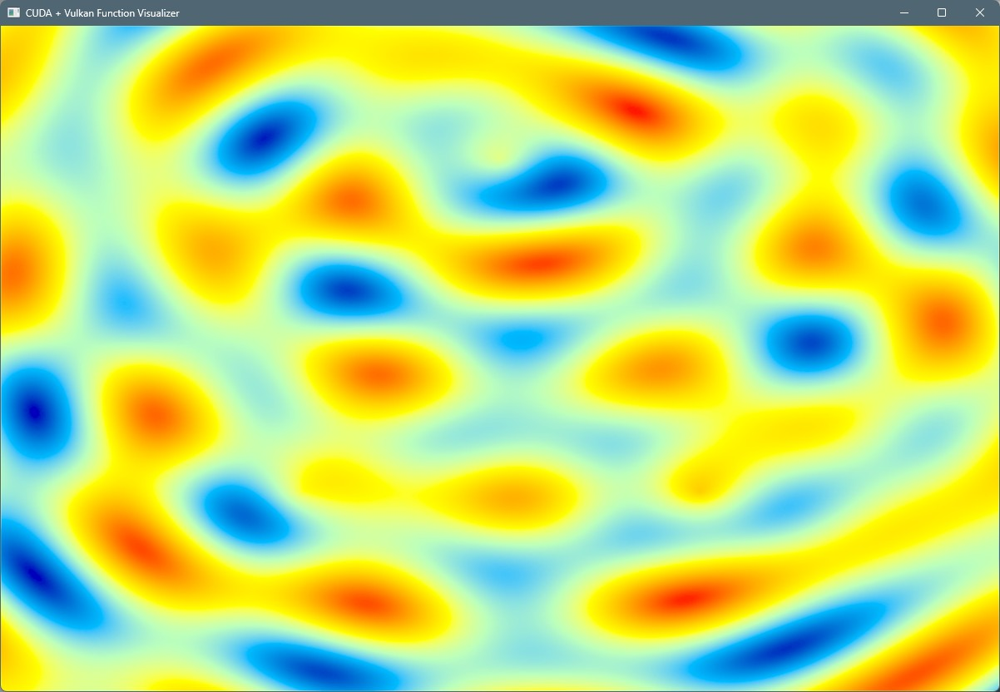

# CUDA + Vulkan Function Visualizer

A real-time visualization application that combines CUDA GPU compute capabilities with Vulkan graphics rendering to display mathematical functions and algorithms.

## Features

This application provides interactive visualization of various mathematical functions and algorithms:

1. **Mandelbrot Set** - Classic fractal visualization with zoom and pan
2. **Julia Set** - Interactive Julia set with adjustable parameters
3. **Sine Wave** - Multi-dimensional sine wave patterns
4. **Heat Equation** - Real-time heat diffusion simulation
5. **Game of Life** - Conway's cellular automaton
6. **Perlin Noise** - Procedural noise generation
7. **Wave Interference** - Multiple wave source interference patterns
8. **Fluid Simulation** - Simplified fluid dynamics visualization

## Technical Architecture

- **CUDA Compute**: GPU kernels for mathematical computations
- **Vulkan Graphics**: Modern graphics API for efficient rendering
- **Real-time Interaction**: Mouse and keyboard controls for parameter adjustment
- **Cross-platform**: Designed to work on Windows, Linux, and macOS

## Prerequisites

### Required Software
- **CUDA Toolkit** (11.0 or later)
- **Vulkan SDK** (1.3 or later)
- **CMake** (3.18 or later)
- **C++ Compiler** with C++17 support (MSVC, GCC, or Clang)

### Required Libraries
- **GLFW3** - Window management and input handling
- **Vulkan** - Graphics rendering
- **CUDA Runtime** - GPU compute operations

## Building the Project

### Windows (Visual Studio)

1. **Install Prerequisites**:
   ```powershell
   # Install CUDA Toolkit from NVIDIA website
   # Install Vulkan SDK from LunarG website
   # Install vcpkg for package management
   git clone https://github.com/Microsoft/vcpkg.git
   cd vcpkg
   .\bootstrap-vcpkg.bat
   .\vcpkg integrate install
   ```

2. **Install Dependencies**:
   ```powershell
   .\vcpkg install glfw3:x64-windows
   ```

3. **Build Project**:
   ```powershell
   mkdir build
   cd build
   cmake .. -DCMAKE_TOOLCHAIN_FILE=[vcpkg root]/scripts/buildsystems/vcpkg.cmake
   cmake --build . --config Release
   ```

### Linux

1. **Install Prerequisites**:
   ```bash
   # Ubuntu/Debian
   sudo apt update
   sudo apt install cmake build-essential nvidia-cuda-toolkit
   
   # Install Vulkan SDK
   wget -qO - https://packages.lunarg.com/lunarg-signing-key-pub.asc | sudo apt-key add -
   sudo wget -qO /etc/apt/sources.list.d/lunarg-vulkan-focal.list https://packages.lunarg.com/vulkan/lunarg-vulkan-focal.list
   sudo apt update
   sudo apt install vulkan-sdk
   
   # Install GLFW
   sudo apt install libglfw3-dev
   ```

2. **Build Project**:
   ```bash
   mkdir build
   cd build
   cmake ..
   make -j$(nproc)
   ```

### macOS

1. **Install Prerequisites**:
   ```bash
   # Install Homebrew if not already installed
   /bin/bash -c "$(curl -fsSL https://raw.githubusercontent.com/Homebrew/install/HEAD/install.sh)"
   
   # Install dependencies
   brew install cmake glfw
   
   # Install CUDA (if using NVIDIA GPU)
   # Download from NVIDIA website
   
   # Install Vulkan SDK
   # Download from LunarG website
   ```

2. **Build Project**:
   ```bash
   mkdir build
   cd build
   cmake ..
   make -j$(sysctl -n hw.ncpu)
   ```

## Usage

### Running the Application
```bash
./CudaVulkanVisualizer
```

### Controls

#### Visualization Modes

| Mode (Key) | Name                | Preview                                  |
|------|---------------------|------------------------------------------|
| 1    | Mandelbrot Set      |             |
| 2    | Julia Set           |                  |
| 3    | Sine Wave           |                  |
| 4    | Heat Equation       |              |
| 5    | Game of Life        |               |
| 6    | Perlin Noise        |               |
| 7    | Wave Interference   |          |
| 8    | Fluid Simulation    |           |

#### Navigation
- **Mouse Drag**: Pan the view
- **Mouse Scroll**: Zoom in/out
- **Arrow Keys**: Adjust function parameters
- **Space**: Reset parameters to defaults
- **ESC**: Exit application

#### Parameter Controls (Mode-Specific)
- **Julia Set**: Left/Right arrows adjust real component, Up/Down adjust imaginary component
- **Sine Wave**: Up/Down adjust frequency, Left/Right adjust amplitude
- **Heat Equation**: Up/Down adjust diffusion rate
- **Perlin Noise**: Up/Down adjust scale, Left/Right adjust octaves

## Project Structure

```
Cuda_practice/
├── CMakeLists.txt              # Build configuration
├── README.md                   # This file
├── include/                    # Header files
│   ├── Application.h           # Main application class
│   ├── CudaCompute.h          # CUDA computation interface
│   ├── VulkanRenderer.h       # Vulkan rendering system
│   └── Window.h               # Window management
├── src/                       # Source files
│   ├── main.cpp               # Application entry point
│   ├── Application.cpp        # Application implementation
│   ├── CudaCompute.cpp        # CUDA wrapper implementation
│   ├── CudaKernels.cu         # CUDA kernel implementations
│   ├── VulkanRenderer.cpp     # Vulkan renderer implementation
│   └── Window.cpp             # Window management implementation
└── shaders/                   # Vulkan shaders
    ├── vertex.vert            # Vertex shader
    └── fragment.frag          # Fragment shader with color mapping
```

## Performance Notes

- The application is designed to run at 60 FPS with real-time parameter updates
- CUDA kernels are optimized for parallel execution on GPU
- Vulkan provides low-overhead graphics rendering
- Memory transfers between GPU and CPU are minimized for optimal performance

## Troubleshooting

### Common Issues

1. **CUDA not found**: Ensure CUDA Toolkit is properly installed and PATH is set
2. **Vulkan validation errors**: Install Vulkan SDK and validation layers
3. **GLFW linking issues**: Verify GLFW3 is installed correctly
4. **Shader compilation errors**: Check that shader files are copied to build directory

### System Requirements

- **GPU**: NVIDIA GPU with CUDA Compute Capability 3.5+
- **Graphics**: Vulkan 1.0 compatible GPU
- **RAM**: 4GB minimum, 8GB recommended
- **OS**: Windows 10+, Ubuntu 18.04+, macOS 10.14+

## License

This project is for educational and demonstration purposes. Please ensure you have appropriate licenses for CUDA Toolkit and Vulkan SDK when distributing.

## Contributing

Feel free to submit issues and enhancement requests. This project serves as a foundation for learning GPU computing and graphics programming concepts.

## Future Enhancements

- Add more mathematical functions and algorithms
- Implement compute shader variants for comparison
- Add ImGui interface for better parameter control
- Support for multiple GPU devices
- Performance profiling and optimization tools
- Save/load parameter presets
- Export rendered frames as images or video
